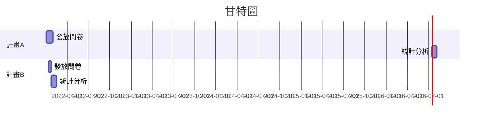

# Markdown 語法 in HackMD

[](https://hackmd.io/xrBJVlm9TrmGaHtqoR8VEg)

[ToC]
###### tags: `Markdown` `HackMD`

## :memo: 初階入門者必備

### :rocket: 設定 標題、層級與標籤(tag)

**\#** :arrow_right: 設定 標題、層級與標籤(tag)
| H1   | H2    | H3     | ...  | tags        |
| :---: | :---: | :---: | :---: | :---------: | 
| # h1 | ## h2 | ### h3 | #... | ######tags: |

若層級設好之後，使用\[toc]指令，可以自動產生目錄樹

### :rocket: 圖示與emoji(:smile:)
**\:** :arrow_right: ICON與emoji
emoji有非常多，可以到 [emoji列表看看 :link: ](https://gist.github.com/rxaviers/7360908) 

### :rocket: 粗體 斜體 刪除線 底線 上標 下標[超鏈結google](http://www.google.com):link:
**粗體**  *斜體*  ~~刪除線~~ ++底線++ 上^標^ 下~標~ [超鏈結google](http://www.google.com):link:
```markdown
[markdown]語法
**粗體**  *斜體*  ~~刪除線~~ ++底線++ 上^標^ 下~標~ [超鏈結google](http://www.google.com):link:
```
### :rocket: 無序與有序清單(列表)

無序列表

早上起床第一件事 
+ 關鬧鐘
+ A1
+ A2
- 刷牙
- B1
- B2
* 上廁所 
* C1
* C2
```markdown=
[markdown]語法
早上起床第一件事 
+ 關鬧鐘
+ A1
+ A2
- 刷牙
- B1
- B2
* 上廁所 
* C1
* C2
```

有序列表
早上起床第一件事 
1. 關鬧鐘 
2. 刷牙 
3. 上廁所 
```markdown=
[markdown]語法
有序列表
早上起床第一件事 
1. 關鬧鐘 
2. 刷牙 
3. 上廁所 
```

### :rocket: 表格

| Column 1 | Column 2 | Column 3 |
|  :----   |  :-----: |  ----:   |
| Text     | Text     | Text     |

:---靠左    :---:置中    ---:靠右
```markdown=
[markdown]語法
| Column 1 | Column 2 | Column 3 |
|  :----   |  :-----: |  ----:   |
| Text     | Text     | Text     |

```
### :rocket: 插入圖片


```markdown 
[markdown]語法

 
第二個圖可以指定像素px，依照比例縮放
```

### :rocket: 程式碼區塊

markdown的程式碼區塊用連續的\`\`\`+程式語言(檔案格式)，
再用\`\`\`做結尾，我們以python c json為例來示範一下
1. json : ‵‵‵json= 與 ```json=

```json!=
{
  "firstName": "John",
  "lastName": "Smith",
  "age": 25
}
```
> [markdown]語法 [color=red]
\`\`\`json=
{
  "firstName": "John",
  "lastName": "Smith",
  "age": 25
}
\`\`\`
>


2. c/c++ : ‵‵‵c= 與 ```clike=
```c=
printf();
```
3. python : ‵‵‵python=
```python=
print("Hello!")
```
4. 一小段程式碼`prinf('Hello')` 輸出 Hello
```markdown
[markdown]語法
一小段程式碼`prinf('Hello')` 輸出 Hello
```

### :rocket: 區塊(顏色)

:::success 
:::
```markdown=
[markdown]語法
:::success
:::
```
:::info
:::
```markdown=
[markdown]語法
:::info
:::
```
:::warning
:::
```markdown=
[markdown]語法
:::warning
:::
```
:::danger
:::
```markdown=
[markdown]語法
:::danger
:::
```
:::spoiler Click me!
Supprised!
:::
```markdown=
[markdown]語法
:::spoiler Click me!
Supprised!
:::
```

### :rocket: To-do List

- [ ] 選項A
- [x] 選項B
    - [ ] 選項B-1
    - [x] 選項B-2
        - [ ] 選項Ｂ-2-1
        - [x] 選項Ｂ-2-2
- [ ] 選項C
```markdown=
[markdown]語法
- [ ] 選項A
- [x] 選項B
    - [ ] 選項B-1
    - [x] 選項B-2
        - [ ] 選項Ｂ-2-1
        - [x] 選項Ｂ-2-2
- [ ] 選項C
```


### 數學方程式
1. 二次方程式的公式解
$$
x = {-b \pm \sqrt{b^2-4ac} \over 2a}
$$


### 流程圖
1. 循序圖
```sequence
艾莉絲->包柏: 哈摟，你好嗎？
Note right of 包柏: 包柏思考中
包柏-->艾莉絲: 我很好，謝謝！
Note left of 艾莉絲: 艾莉絲回應
艾莉絲->包柏: 最近過得怎樣？
```
2. 流程圖
```flow
st=>start: 開始
ed=>end: 結束 
op1=>operation: Input a,b
cond=>condition: a<b？
st->op1->cond->
cond(yes)->ed
cond(no)->op1
```
3. 甘特圖



- And MORE ➜ [HackMD Tutorials](https://hackmd.io/c/tutorials)
Author - [name=林奇賢]


